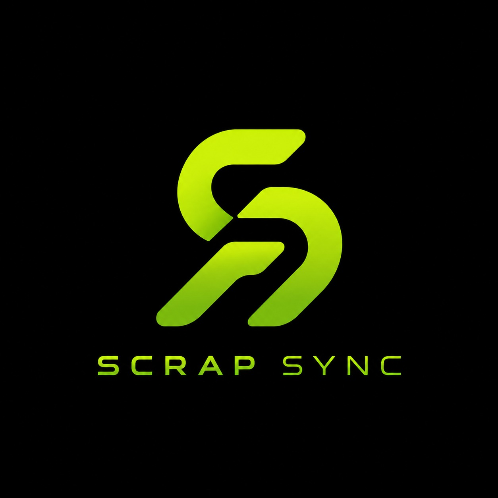
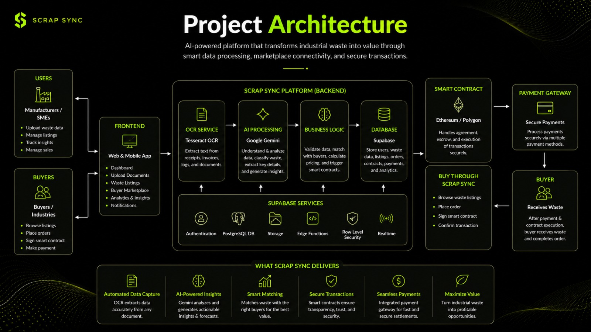

# ♻️ ScrapSync: Industrial Symbiosis & Automated Brokerage Console

    

**ScrapSync** is an AI-powered B2B reverse-matchmaking platform designed to power the circular economy. It connects industrial manufacturers with local buyers and recyclers, transforming industrial waste (like untreated sawdust and copper wire) into profitable, reusable raw materials.

## 🔗 Project Links

- 🌐 **Live Demo:** [ScrapSync Web App](https://scrap-sync-frontend.onrender.com)
- 🎥 **Pitching Video (Google Drive):** [Watch Here](https://drive.google.com/drive/folders/1ox8D8IsAwkZe4uH7nqIXbbRdv1b6trTK?usp=sharing)

All the documentation has been include in the github including PRD, SAD, QTAD and Pitchingdeck. all in pdf.
## 📁 Project Structure
<div align="center">
  
</div>

## ✨ Key Features

* 🧠 **AI Synergy Engine:** Upload single or batch PDF/image waste manifests. Gemini API instantly extracts visual text, calculates transport vs. material costs, and finds the most profitable local buyer.
* 💳 **Live FPX B2B Payments:** Fully integrated with the **Stripe API**, allowing users to execute digital twin smart contracts and process mock B2B banking transactions via Malaysian FPX gateways (Maybank2U, CIMB Clicks, etc.).
* 🔮 **Predictive Insights:** Forecasts weekly waste generation patterns, alerting factories to pre-optimize logistics and lock in regional market rates before seasonal oversupply drops prices.
* 📋 **Corporate Ledger:** An immutable, real-time transaction ledger powered by **Supabase PostgreSQL**.
* 🔐 **Enterprise Auth:** Secure hybrid registration allowing enterprises to act seamlessly as both buyers and sellers using Supabase Authentication.

## ✨ Project Architecture


## 🛠️ Technology Stack

* **Frontend UI:** Streamlit (Python)
* **Backend / Database:** Supabase (PostgreSQL, Authentication)
* **Payments Gateway:** Stripe Python SDK (FPX Test Environment)
* **AI/Computer Vision:** FastAPI Backend + AI extraction model (via `requests`)
* **Data Processing:** Pandas, NumPy

## 🚀 Installation & Setup

Follow these instructions to run the ScrapSync application on your local machine.

### 1. Clone the Repository
```bash
git clone https://github.com/Axelzy/scrap-sync.git
cd scrap-sync
```
### 2. Install The Dependencies
Run ```pip install -r requirements.txt```

### 3. Run

```bash
python backend/main.py
python -m streamlit run frontend/app.py
```
### 4. Login

Email: `pahangmetal@gmail.com`\
password: `password`
